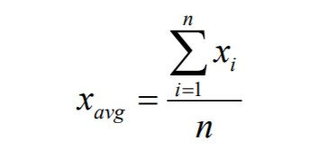
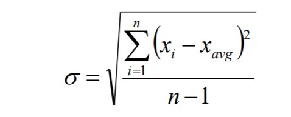
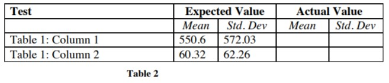
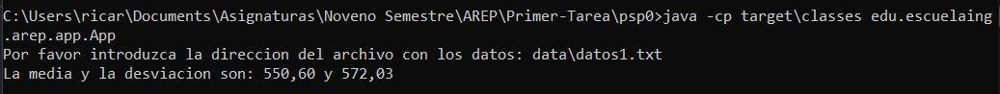
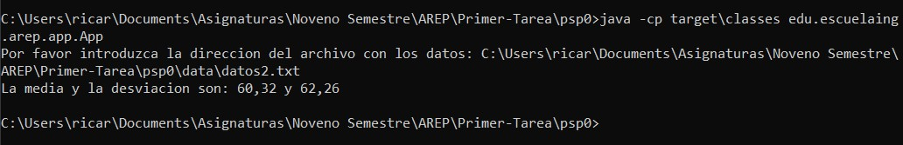

# AREP - Taller #1
El ejercicio consiste en realizar un programa para calcular la media y la desviación estándar de un conjunto de datos leídos desde un archivo.
Además se requiere crear una implementación de listas enlazadas (linked list) para el manejo de los datos.

## Definiciones

### Lista Enlazada (Linked List)
Las listas enlazadas son un tipo de datos abstractos comunes que se utilizan para mantener colecciones de datos.

Las listas enlazadas se implementan con punteros.
Una lista vinculada generalmente tiene dos componentes.
* Encabezado de lista
* Lista de nodo(s)

### Media
La media es el promedio de un conjunto de datos.

### Desviación estándar
La desviación estándar es una medida de la extensión o dispersión de un conjunto de datos.
Cuanto mayor sea la dispersión de los valores, mayor será la desviación estándar. 

### Fórmulas

Media

Desviación estándar

El enunciado del ejercicio ya nos da dos tablas con información, una con los datos y otra con los resultados de la media y la desviación estándar. Los datos de la tabla 1 se encuentran en la carpeta [data](data) del repositorio y el resultado que da este programa puede observarlo en la sección de [ejemplos](#Ejemplos) y compararlo con el resultado en la tabla 2.

## Comenzando 
Para obtener una copia local del repositorio puede ejecutar la siguiente línea en la consola de comandos.
    
    git clone https://github.com/Ricar8o/AREP-Taller-1.git

## Pre-requisitos

Debe tener instalado lo siguiente:

* [GIT](https://git-scm.com/book/es/v2/Inicio---Sobre-el-Control-de-Versiones-Instalación-de-Git)
* [JAVA 8](https://www.java.com/es/download/)
* [MAVEN](https://maven.apache.org)

GIT no es completamente necesario pero si es recomendable, también puede descargar el repositorio como un .zip.

## Pruebas y Compilación

Para compilar el proyecto podemos ejecutar varias opciones. 

* Para compilar el codigo fuente únicamente.

        mvn compile
* Para ejecutar las pruebas.

        mvn test
* Para ejecutar todas las fases.

        mvn package

## Ejecución
Para ejecutar el programa puede hacerlo desle la linea de comandos ejecutando cualquiera de las siguientes opciones.

*       java -cp target\classes edu.escuelaing.arep.app.App
*       java -cp target\CalculatorApp-1.0-SNAPSHOT.jar edu.escuelaing.arep.app.App

### Nota: 
El método calcular de la clase Calculator es quien muestra los resultados redondeados a dos cifras decimales, los métodos que calculan la media y la desviación estándar no redondean los resultados.

## Ejemplos

En el repositorio se encuentran dos archivos con extensión txt en una carpeta llamada [data](data). Los archivos tiene datos numéricos, un dato por línea. 

Al ejecutar el programa se le pedirá que escriba la ruta del archivo que quiere ser leído, si el archivo se encuentra en la carpeta donde ejecuto el programa entonces puede escribir la ruta de la siguiente manera.

También puede escribir la ruta completa.

## Documentación

La documentacion se encuentra en la carpeta del repositorio llamada [docs](docs), pero en caso de que quiera generarla tiene las siguientes opciones.

### Maven
Para generar la documentacion con Maven puede ejecutar cualquiera de los siguientes comandos.

*        mvn javadoc:javadoc
*        mvn javadoc:jar

### Java
Si quiere generarla usando java puede hacerlo con el siguiente comando.

*       javadoc -d docs src\main\java\edu\escuelaing\arep\app\*.java src\main\java\edu\escuelaing\arep\app\model\*.java

## PDF Diseño

[DESCRIPCION.PDF](Descripcion.pdf)

## Autor 

Andrés Ricardo Martínez Díaz - [Ricar8o](https://github.com/Ricar8o)

## Licencia
Mire el archivo [LICENSE.md](LICENSE.md) para más detalles.
